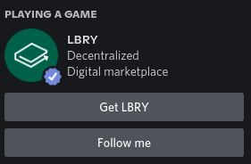

# Discord Rich Precence
> A quick node.js application for Discord Rich Precence

This code is made to give you a LBRY status on discord. Where there is a button for getting LBRY and another for following. 



## Prerequisites

Requirements to run this
- [Node.js](https://nodejs.org/)
- [npm](https://www.npmjs.com/)

## Installation

```sh
git clone https://github.com/Pigges/DiscordRPC.git
cd DiscordRPC/
npm i
```

## Usage

```sh
npm start
```

## License

Distributed under the Unlicense license. See ``LICENSE`` for more information.

[https://github.com/Pigges/DiscordRPC](https://github.com/Pigges/DiscordRPC)

## Contributing

1. Fork it (<https://github.com/Pigges/DiscordRPC/fork>)
2. Create your feature branch (`git checkout -b feature/fooBar`)
3. Commit your changes (`git commit -am 'Add some fooBar'`)
4. Push to the branch (`git push origin feature/fooBar`)
5. Create a new Pull Request